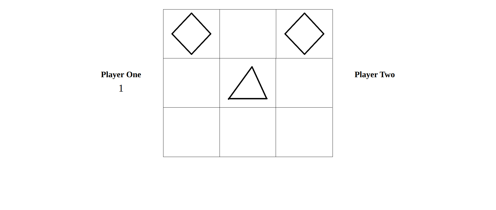

#This is a library app project created for the Odin Project.

image

# Goal
The goal of this project is to recreate tic toe tac that can be played with one other person or with a AI bot.

# Features
- Can choose to play with another person or an AI bot.
- Can choose the difficulty of the AI
- Can choose from four different markers.
- Can choose who goes first or have it be chosen randomly

# Tools and Technologies
- Visual Studio Code
- HTML
- Javascript
- CSS
- Github and Git
- Linux Command Line
- Chrome Dev Tools
- Excalidraw (For brainstorming and mock drawups)

# Things I've Learned and Noticed
- Learned how to make and use modules and factory functions.
- Learned a little bit about algorithms and hhow they are used to make ai.
- Was able to minimize global variables to just one.

# Self Reflection

This is my first project where I did refactoring after finishing a project. Upon reviewing my code, I noticed some redundancies that could be rectified with better code. Below are some things I did to make the code more reabable, simpler, and cleaner:

- Used `querySelectorAll` function and `forEach` function to shorten certain areas of code. 

- Removed unnecessary functions that were doing the samething and just had one function be responsible for what those functions did.

- Made sure that all functions focused on doing one thing and not a bunch of other things that are not related to it.

Making my functions as small and singleminded as possible really helped with testing and made my code very modular and scalable. Factory functions and modules also played a big part in the scalabilty of the code. When I needed to add something new, they made it so that I didn't need to make any drastic changes in many areas of my code. 

One problem I noticed was when the js file got bigger and bigger, it made it very difficult to find code in certain places and it made looking at the code very unpleasant. Refactoring helped a lot but I think eventually I will want to start having multiple javascripts files and place code in certain files to keep things nice and clean.

One important thing I learned from this project is that one should never underestimate the complexity of things that look simple from afar. This tic tac toe project was more challenging and time-consuming than I expected and I can only imagine how much more time and how much more planning more complex projects would require. I have more appreciation for those in the field of programming. 

# Credits

The algorithm and functions used to make the Ai were created by Ahmad Abdolsaheb. The code was taken from his article on the [freecodecamp website](https://www.freecodecamp.org/news/how-to-make-your-tic-tac-toe-game-unbeatable-by-using-the-minimax-algorithm-9d690bad4b37/)